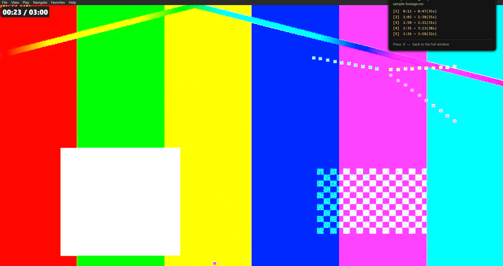
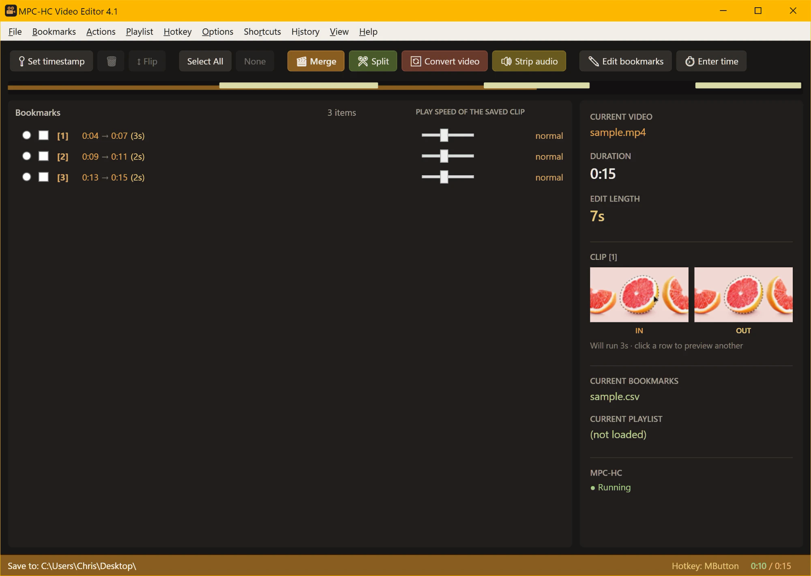
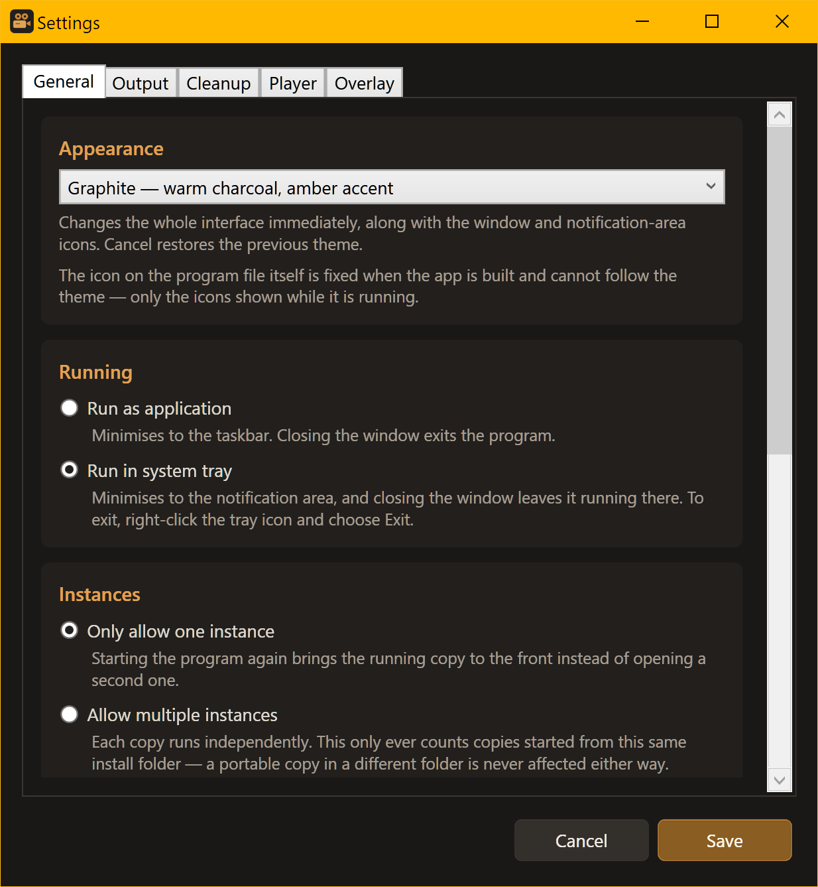
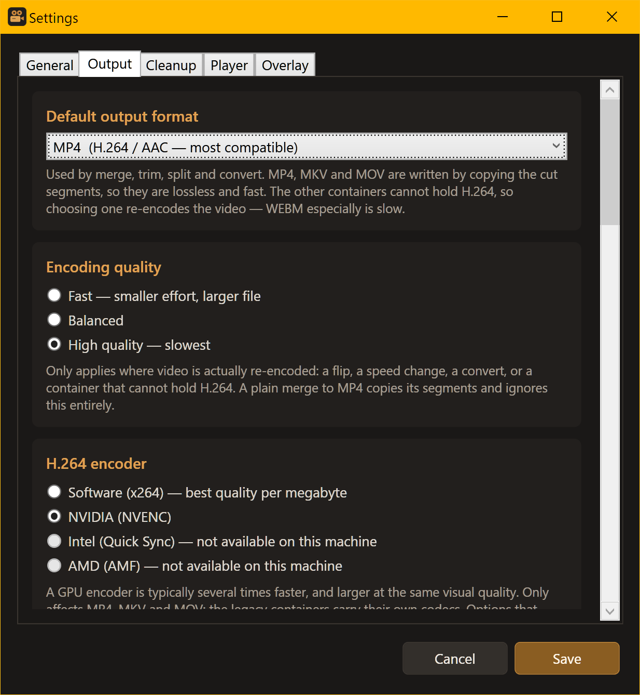
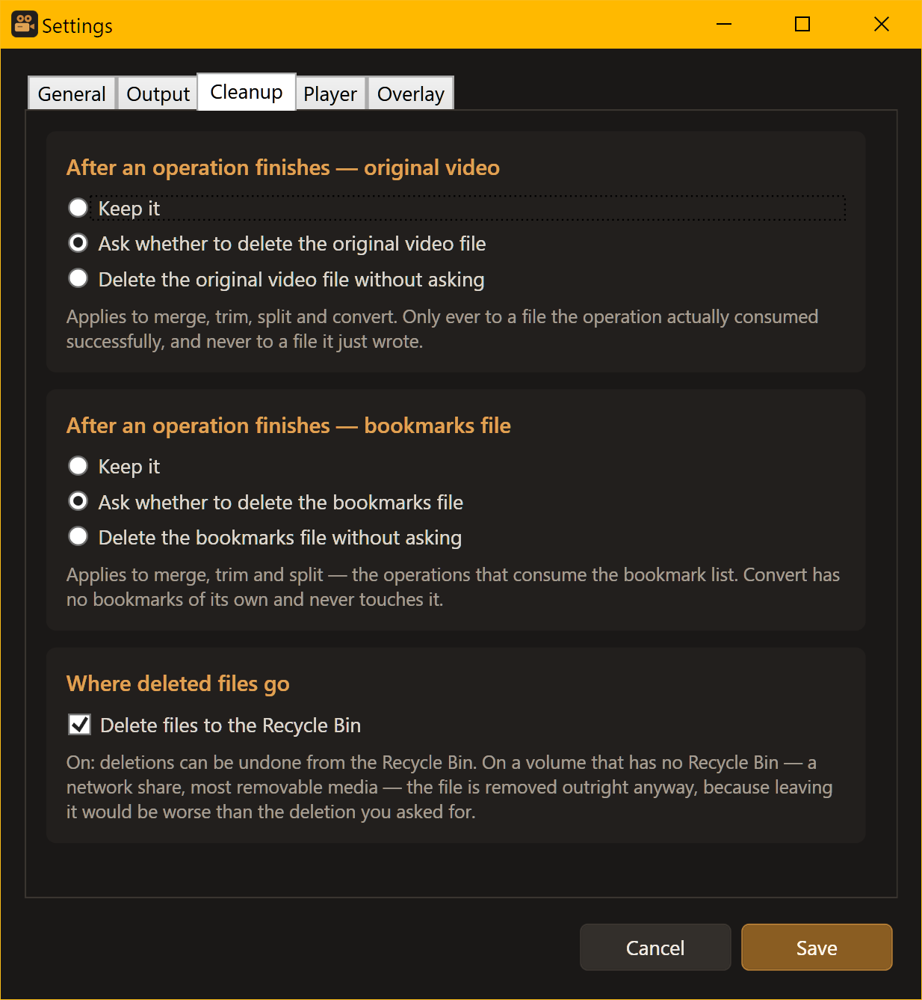
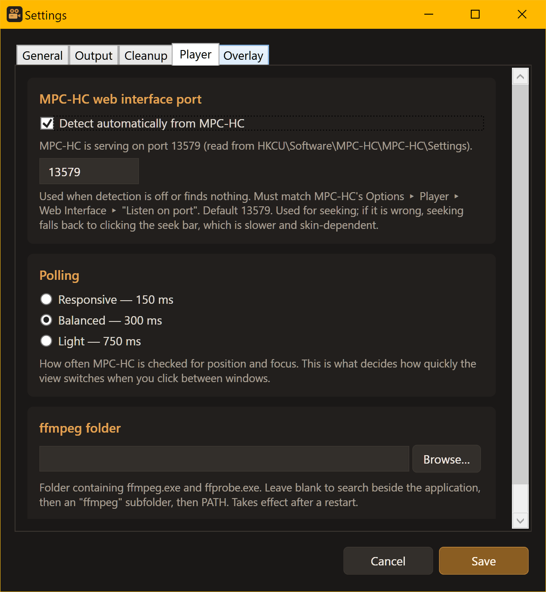
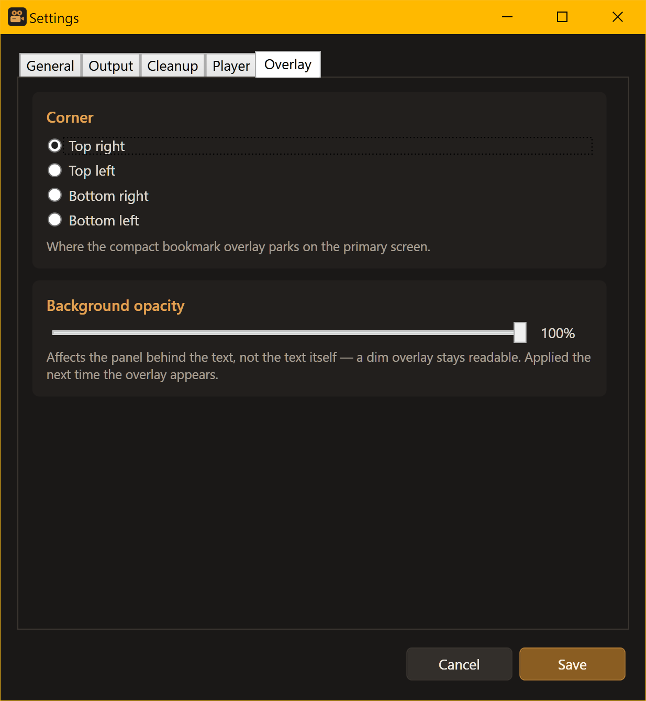

# MPC-HC Video Editor (C# / WPF)

Modern rewrite of the original AutoHotkey **MPC-HC Video Editor v2.1**.

Bookmark ranges in a video playing in MPC-HC, then cut, join, convert or
extract audio from them with ffmpeg.



**Fully portable.** Everything the app writes — `settings.json`, `stalls.log` —
lives beside the executable. Nothing goes to `%APPDATA%` and there is no
installer. Copy the folder anywhere and it runs. On first launch it copies an
existing `%APPDATA%\MPC-HC Video Editor\settings.json` in, if one is there, so
an earlier non-portable install's configuration carries over.

---

## Screenshots

The overlay above is what you work in while the video is playing — it is
click-through, never takes focus, and lists every bookmark without scrolling.

The full window is the other half: the bookmark list and its per-cut controls,
the action toolbar, and the current video, bookmarks and player state down the
right-hand side.



Settings, in five tabs:

<table>
<tr>
<td width="50%"></td>
<td width="50%"></td>
</tr>
<tr>
<td><strong>General</strong> — theme, run mode, instances</td>
<td><strong>Output</strong> — format, quality, encoder</td>
</tr>
<tr>
<td width="50%"></td>
<td width="50%"></td>
</tr>
<tr>
<td><strong>Cleanup</strong> — what is deleted, and where it goes</td>
<td><strong>Player</strong> — web interface port, polling, ffmpeg</td>
</tr>
<tr>
<td colspan="2" align="center"></td>
</tr>
<tr>
<td colspan="2" align="center"><strong>Overlay</strong> — corner and background opacity</td>
</tr>
</table>

---

## Bookmarks

A bookmark is a **timestamp pair**: press the hotkey once to open it, again to
close it. An open bookmark shows as *incomplete* until it has an end time.

- **Set timestamp: `<hotkey>`** — the menu label shows the live binding.
- Closing a bookmark at or before its start is **refused**: the whole entry is
  discarded rather than silently fudged into a bogus one-second cut, so a bad
  entry never survives the action that created it.
- A first timestamp at 0 is nudged to the first second — the player reports 0
  before playback has really begun, and ffmpeg's seek at 0 is unreliable.
- **Undo last bookmark** removes the last *single timestamp*, not the pair: a
  closed bookmark loses only its end time and reopens; a lone start time is
  dropped. If that empties the file, the CSV goes too.
- **Edit bookmarks** opens the CSV in a text editor. Changes are picked up when
  the window regains focus; saving it empty deletes the file.
- **Enter time / range…** accepts `90`, `1:30`, `1:02:03`, `22s`, `5m`, `1h`,
  `1m30s`, and ranges like `1:00 - 2:30`. A rejected value re-opens the dialog
  explaining what went wrong and what is accepted, rather than closing.
- **Delete bookmarks** deletes the CSV and marks the file not-loaded.
- **Remove selected timestamps** removes the checked cuts from the list and the
  file.
- **Play all cuts** / **Play selected cuts** seek MPC-HC to each cut and play it
  for its effective duration (duration ÷ speed). Timed against the wall clock,
  so cuts end where they should.
- Per-bookmark **speed slider** (0.25x – 2.0x) and a **flip** toggle that marks
  the checked cuts for vertical inversion, shown as `[F]` on the row.
- Only complete pairs can be checked — an open bookmark has no range to act on.
- Clicking a start or end time **seeks MPC-HC** to that moment.

The CSV format matches the original AutoHotkey version. It is saved next to the
video, and an empty one is never created.

---

## Actions

Output filenames use the active **naming tag** (see Options), e.g.
`vacation.mp4` → `vacation[done].mp4`.

- **Merge selected / all / any** — always available. With cuts loaded it joins
  the checked ones, or all of them when none are checked. With no video or cuts
  it falls back to a file picker and joins whatever you select.
- **Split selected / all** — one clip per cut.
- **Convert files to MP4…** and **Strip audio to MP3…** — both take multiple
  files at once.

### Filename collisions

When an output name is taken you are asked to **Overwrite**, **Increment** or
**Rename**. Increment bumps the number in the bracket — `[done]` → `[done2]`,
`[cs3]` → `[cs4]` — and Rename changes only the base name, keeping the suffix.
The question repeats until the name is actually free, since a rename or an
increment can collide too.

### Filename rules

Names the app writes allow letters, numbers, dash, underscore, square brackets
and parentheses. No spaces, and no doubled punctuation. A name that breaks the
rules prompts for a replacement, pre-filled with a suggested correction (spaces
become dashes, disallowed characters are dropped, runs collapse). The field
rejects bad characters as you type and explains why. Source files are never
renamed — only what the app is about to write has to comply.

---

## Views

- **View ▸ Minimal** pins a compact always-on-top overlay listing just the
  bookmarks, for when the video covers the window. It is click-through and never
  takes focus, and it makes MPC-HC the active window as it switches, so the
  result is the same whatever happened to be behind this window. The pin lasts
  until you press **X** or pick **Full** — no amount of clicking between windows
  ends it. What the pin holds is the *mode*, not one window: the overlay is up
  while MPC-HC has focus, and the full window comes back whenever it does not,
  so the overlay never floats over an unrelated application and the program is
  never left with nothing on screen. Going back to the player returns to the
  overlay without the pin being dropped. Disabled when there are no bookmarks —
  the overlay is the bookmark list, so there would be nothing in it.
- **X** is live only while the overlay is actually on screen, so a stray "x"
  typed in another application cannot pull this window back. Nothing is stranded
  by that: whenever the overlay is down the full window is up in its place, and
  **View ▸ Full** there ends the pin just as X would.
- **View ▸ Full** returns to the normal window.
- **View ▸ Switch views automatically** makes the view follow focus instead:
  minimal while MPC-HC is the active window, full window as soon as it is not.
  It layers under a pinned overlay rather than competing with it — pinning holds
  the overlay still while the setting stays on, and X hands control back to it.
  The setting changes only when you change it.

Either way the overlay comes down if the bookmark list empties (opening another
video in the player clears it), and returns with the next bookmark.

### Timeline

The bar under the toolbar shows playback position plus a **range mark per
bookmark** — amber normally, teal when checked, orange when marked for
inversion, and a thin red tick for an open bookmark.

### Progress

Running an action shows a panel above the status bar with the operation, file
*n* of *m*, the current file and step, percentage, elapsed and remaining time.
The bar's colour is interpolated from the percentage: black → red → orange →
yellow → green.

Routine messages go to the **status bar**, not popups. Dialogs are reserved for
confirming destructive actions, reporting real failures, and asking for input.

---

## Files and folders

Two separate output destinations:

- **Save to:** — where merge, split, convert and strip audio write. Follows the
  loaded video's folder until you pick one, then stays put for the session.
  Resets on restart.
- **Quick save:** — used *only* by the one-click save button on each bookmark
  row. Persisted.

**Quick save shortcuts** (File menu) are folders with a **Set** / **Remove**
submenu; Set points Quick save at that folder. Removing one never changes the
current Quick save destination.

**Shortcuts** (own menu) is a separate list that simply opens folders in
Explorer. It has nothing to do with quick save.

**History** (own menu) lists recently played videos; click one to launch it in
MPC-HC. Dead entries are pruned when clicked. Only real video files are ever
recorded.

**Drag and drop** a video, a `.csv` or a `.pls` onto the window to load it.

---

## Playlists

- **Playlist folder:** — the folder scanned for `.pls` files.
- **Load playlist…** loads a playlist and starts the first entry that still
  exists, skipping missing ones. The player receives the playlist itself, so the
  whole list lands in its playlist.
- A playlist that is empty, or has no files that still exist, is **not loaded**.
- **Unload playlist** forgets the loaded playlist.
- Each playlist expands to its videos. **View playlist content** opens the
  `.pls` in a text editor — not the default handler, which is a media player and
  would simply play it. A missing entry offers only **Remove**, which deletes it
  from the file and renumbers the remaining entries contiguously.
- **Add current video** appends to the loaded playlist without prompting, or
  asks which playlist when none is loaded.

---

## Options

- **Current rename tag:** shows the active suffix, with an **Example:** line
  beneath it. Click any tag in the list to activate it (marked ✓).
- **Add new naming tag…** (letters and numbers, max 50 characters) and
  **Manage naming tags…** (drag to reorder, double-click to rename).
- **Switch views automatically** — see Views.

### Deleting

**Delete files to the Recycle Bin** (Settings ▸ Cleanup) is on by default, so
anything the app removes can be undone. It covers every deletion, including the
post-operation cleanup that runs without asking — which is what makes those
settings safe to turn on.

Turn it off and deletions are permanent. On a volume that has no Recycle Bin —
a network share, most removable media — files are removed outright either way,
because leaving one behind would be worse than the deletion you asked for.

## Hotkey

**Set timestamp hotkey…** opens a dialog that captures from the moment it
appears: press any key, key combination, or the middle / side mouse buttons, and
the field updates live. Click OK to set it. **Disable hotkey** turns it off.
The binding persists in `settings.json`.

The hotkey is global — it has to be, to work while MPC-HC has focus — but it
only ever fires when **MPC-HC is the active window and has a video open**.
Everywhere else the press is ignored and passed along untouched, so the default
middle-mouse binding still opens links in a browser rather than quietly
bookmarking whatever the player last had loaded.

---

## Menu enablement

Menu items are enabled only when they can do something. The rules read from four
pieces of state: whether a video is active in MPC-HC, whether a bookmark file is
loaded, how many complete pairs exist, and how many are checked.

Worth knowing because they are not uniform: **both Play commands need 2+ pairs,
Split needs only 1, and Merge is always available.** Undo, Edit bookmarks,
Delete bookmarks and Remove-selected key off the bookmark file being loaded, not
off a video being active. **View ▸ Minimal** needs at least one bookmark — an
overlay with nothing in it has nothing to show. Convert, Strip audio and the
playlist folder / load / new items are always enabled.

---

## Requirements

- **.NET 8 SDK** to build. The published build is self-contained and needs no
  runtime installed on the target machine.
- **`ffmpeg.exe` and `ffprobe.exe`** beside the executable, in an `ffmpeg\`
  subfolder, or on `PATH` — searched in that order, so a bundled pair makes the
  folder self-sufficient.
- **MPC-HC** for anything that reads or drives the player.

Binaries are validated by running them, not merely found: a copy that exists but
fails to load is skipped in favour of the next working candidate.

## Building

See [BUILD.md](BUILD.md) for the portable publish command and its caveats.

```bash
dotnet restore
dotnet build -c Release
```

## Project layout

```
Dialogs/     CaptureHotkey, Conflict, Input, ManageShortcuts,
             ManageSuffixes, RenameFile
Helpers/     Converters, FileNameRules, PortablePaths, ProgressBrush,
             TimelineRanges
Models/      Bookmark, EditSession, HotkeyBinding, ShortcutEntry, SuffixEntry
Services/    Bookmark, FFmpeg, Hotkey, JobProgress, MpcHc, Playlist,
             Settings, StallMonitor, Toast
ViewModels/  MainViewModel — all commands and menu enablement
Views/       MainWindow, MinimalWindow, ToastWindow
```
